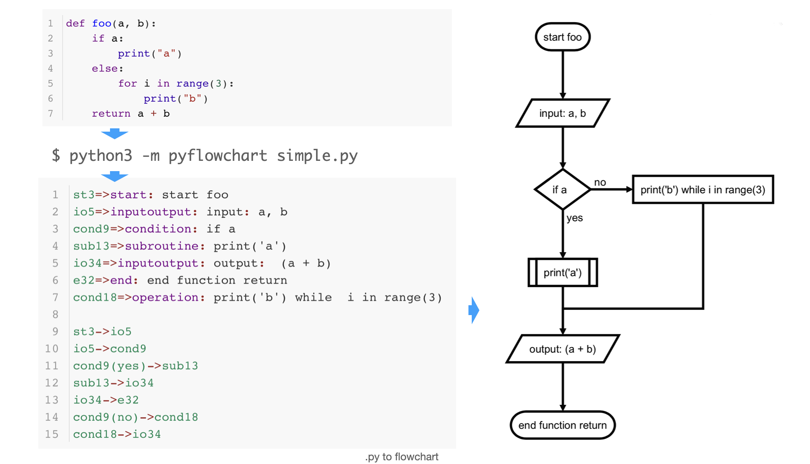
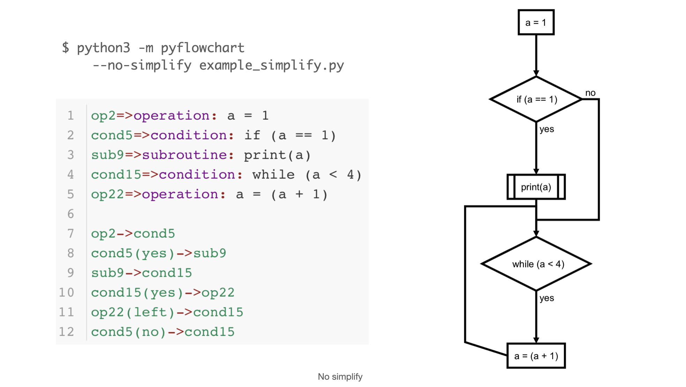

# PyFlowchart

PyFlowchart is a package to:

- write flowcharts in the Python language,
- translate Python source codes into flowcharts.

PyFlowchart produces flowcharts in [flowchart.js](https://github.com/adrai/flowchart.js) flowchart DSL, a widely used flow chart textual representation. It's easy to convert these flowcharts text into a picture via [flowchart.js.org](http://flowchart.js.org), [francoislaberge/diagrams](https://github.com/francoislaberge/diagrams/#flowchart), or some markdown editors. 

## Get PyFlowchart

```sh
$ pip3 install pyflowchart
```

## Quick Start

To flowchartlize your python codes in `example.py`，run:

```sh
$ python3 -m pyflowchart example.py
```

PyFlowchart will output the generated flowchart.js DSL. Go http://flowchart.js.org or use editors like [Typora](https://support.typora.io/Draw-Diagrams-With-Markdown/#flowcharts) to turns the output code into a rendered diagram.

To specify a function (or a method in a class) to flowchartlize:

```sh
$ python3 -m pyflowchart example.py -f function_name
# or
$ python3 -m pyflowchart example.py -f ClassName.method_name
```

🎉 Now you are ready to enjoy the flowchartlization.

Keep reading this document to learn more usages.

## Flowchart in Python

PyFlowchart allows you to write a flowchart in Python which could be translated into the [flowchart.js](https://github.com/adrai/flowchart.js) DSL automatically.

PyFlowchart supports [flowchart.js](https://github.com/adrai/flowchart.js#node-types) node types:

- StartNode
- OperationNode
- ConditionNode
- InputOutputNode
- SubroutineNode
- EndNode

Nodes can be connected by `connect()` method (`connect_{yes|no}` for ConditionNode).

Get a Flowchart with your start node and call its `flowchart()` method to generate flowchart.js flowchart DSL：

```python
from pyflowchart import *

st = StartNode('a_pyflow_test')
op = OperationNode('do something')
cond = ConditionNode('Yes or No?')
io = InputOutputNode(InputOutputNode.OUTPUT, 'something...')
sub = SubroutineNode('A Subroutine')
e = EndNode('a_pyflow_test')

# define the direction the connection will leave the node from
sub.set_connect_direction("right")
    
st.connect(op)
op.connect(cond)
cond.connect_yes(io)
cond.connect_no(sub)
sub.connect(op)
io.connect(e)
 
fc = Flowchart(st)
print(fc.flowchart())
```

Output:

```
st0=>start: start a_pyflow_test
op1=>operation: do something
cond2=>condition: Yes or No?
io3=>inputoutput: output: something...
e5=>end: end a_pyflow_test
sub4=>subroutine: A Subroutine

st0->op1
op1->cond2
cond2->
cond2->
cond2(yes)->io3
io3->e5
cond2(no)->sub4
sub4(right)->op1
```

Then you can visit http://flowchart.js.org and translate the generated textual representation into SVG flow chart diagrams:


P.S. Many Markdown editors (for example, Typora) support this flowchart syntax, too (reference: [Typora doc about flowchart](https://support.typora.io/Draw-Diagrams-With-Markdown/#flowcharts)). And if you prefer CLI, see [francoislaberge/diagrams](https://github.com/francoislaberge/diagrams/#flowchart).

## Python to Flowchart

PyFlowchart can also translate your Python Codes into Flowcharts.

For example, you got a `simple.py`:

```python
def foo(a, b):
    if a:
        print("a")
    else:
        for i in range(3):
            print("b")
    return a + b
```

Run PyFlowchart in CLI to generate flowchart code:

```sh
$ python3 -m pyflowchart simple.py

# output flowchart code.
```

Or, in Python

```python
>>> from pyflowchart import Flowchart
>>> with open('simple.py') as f:
...     code = f.read()
... 
>>> fc = Flowchart.from_code(code)
>>> print(fc.flowchart())

# output flowchart code.
```



## Advanced Usages

As mentioned above, we use `Flowchart.from_code` to translate Python codes into Flowcharts. The `from_code` is defined as:

```python
Flowchart.from_code(code, field='', inner=True, simplify=True)
```

PyFlowchart CLI is a 1:1 interface for this function:

```sh
python3 -m pyflowchart [-f FIELD] [-i] [--no-simplify] code_file
```

Let's talk about those three args:

- `field`: str: Specify a field of code to generate a flowchart
- `inner`: bool:  `True` to parse the body of field; whereas `False` to parse the body as a single object.
- `simplify`: bool: for If & Loop statements: simplify the one-line-body or not

### field

the `field` is the path to a field (i.e. a function) you want to draw a flowchart. 

```python
# example.py
print("start")

def foo():
    foo = "foo"

class Bar():
    def buzz(self, f):
        def g(self):
            print("g")
            f(self)
        return g(self)

Bar().buzz(foo)
print("end")
```

For `example.py` above, available paths are:

    - "" (means the whole code)
    - "foo"
    - "Bar.buzz"
    - "Bar.buzz.g"

To generate a flowchart of `Bar.buzz.g`：

```python
# Python
from pyflowchart import Flowchart
with open('example.py') as f:
	code = f.read()
fc = Flowchart.from_code(code, field='Bar.buzz.g', inner=False)
print(fc.flowchart())
```

Or:

```sh
# CLI
python3 -m pyflowchart example.py -f Bar.buzz.g
```

Output result:


### inner

`inner` controls parser's behaving. Techly, `inner=True` means parsing `field.body`, while `inner=False` parses `[field]`. So, if  `inner=True`, pyflowchart will look into the field, otherwise, it takes the `field` as a node.


For CLI,  adding an argument `-i`  means `inner=True`, else `inner=False`.

### simplify

simplify is for If & Loop statements: simplify the one-line-body.

For example:

```python
# example_simplify.py
a = 1
if a == 1:
    print(a)
while a < 4:
    a = a + 1
```

- Default: `simplify=True`:

```python
flowchart = Flowchart.from_code(example_simplify_py, field="", inner=True)
print(flowchart.flowchart())
# SH $ python3 -m pyflowchart example_simplify.py 
```


- `simplify=False`:

```python
flowchart = Flowchart.from_code(example_simplify_py, field="", inner=True, simplify=False)
print(flowchart.flowchart())
# SH $ python3 -m pyflowchart --no-simplify example_simplify.py 
```



## Beautify Flowcharts

Sometimes, the generated flowchart is awful. In that case, you are encouraged to modify the generated flowchart code by yourself OR consider making your python source code at bottom more clear if it's exceedingly complex.

## TODOs

- [ ] Directly generate flowchart SVG/HTML:

```sh
$ pyflowchart example.py -o flowchart.svg
```

Depends on `node.js` and `flowchart.js`.

- [ ] PyFlowchart GUI

Well, I guess a **GUI** for PyFlowchart may be remarkable. Pasting your code into it, the flowchart DSL will be generated just in time, and the flowchart will be shown aside.

- [ ] ~~The Chinese README your buddies waiting for!~~ 希望有同学帮助贡献个中文 README 呀。

----

Sadly, I am too busy (pronounced as `[ˈlеizi]`——lazy) to code these ideas. Please [submit an issue](https://github.com/cdfmlr/pyflowchart/issues/new) to push me on. Or, PR to make it by yourself. I cannot wait to appreciate your great contribution!

## References

- Inspired by [Vatsha/code_to_flowchart](https://github.com/Vatsha/code_to_flowchart)
- Based on [adrai/flowchart.js](http://flowchart.js.org), [python ast](https://docs.python.org/3/library/ast.html), [simonpercivall/astunparse](https://github.com/simonpercivall/astunparse)
- [A blog about this project](https://clownote.github.io/2020/10/24/blog/PyFlowchart/)

## License

Copyright 2020-2022 CDFMLR. All rights reserved.

Licensed under the MIT License.

