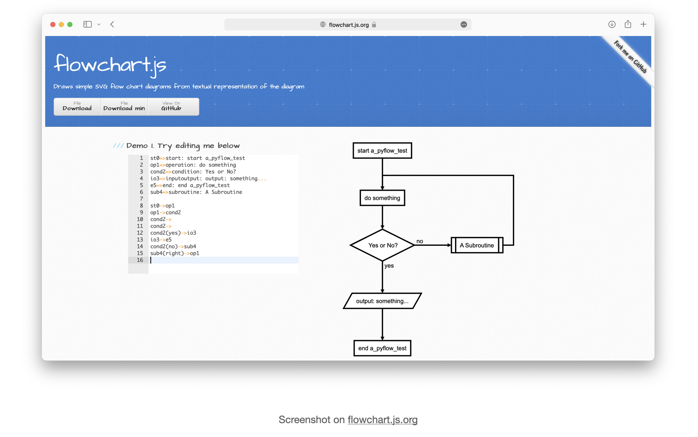
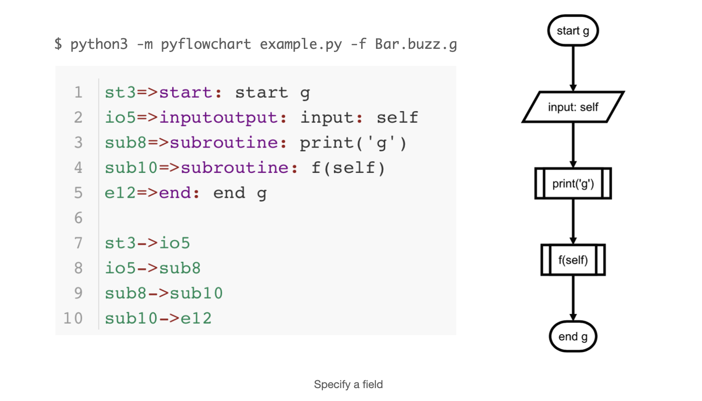
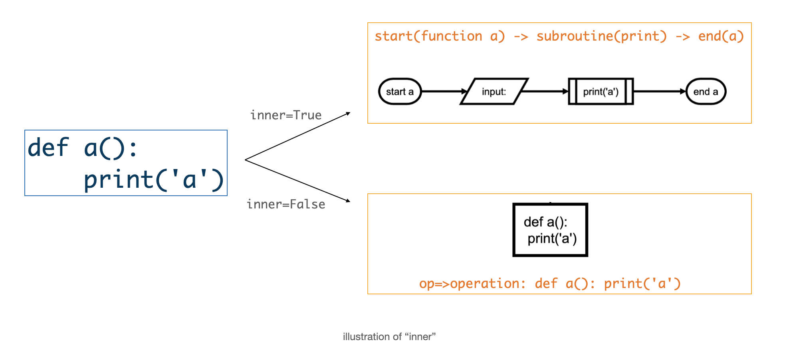
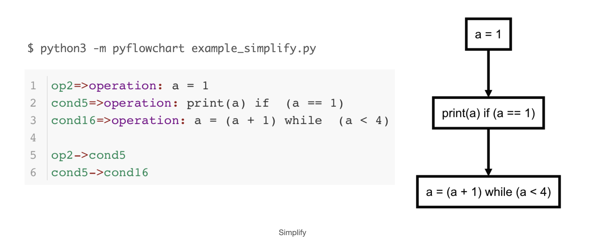
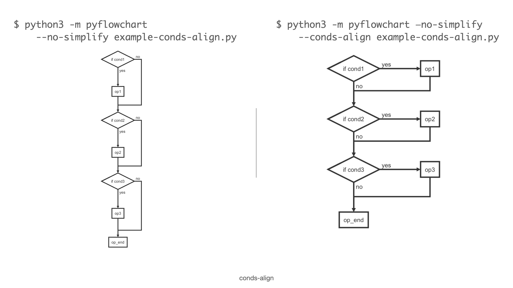

# PyFlowchart

[English](README.md) | 机翻中文

PyFlowchart是一个软件包，用于：

- 用 Python 语言编写流程图；
- 将 Python 源代码翻译成流程图。

PyFlowchart 用 [flowchart.js](https://github.com/adrai/flowchart.js) DSL 来绘制流程图，这是一种广泛使用的流程图文本表示。通过[flowchart.js.org](http://flowchart.js.org)、[francoislaberge/diagrams](https://github.com/francoislaberge/diagrams/#flowchart)或一些markdown编辑器，很容易将这些流程图文本转换成图片。


## 安装 PyFlowchart

```sh
$ pip3 install pyflowchart
```

## 快速开始

要将 `example.py` 中的 Python 代码流程图化，运行:

```sh
$ python3 -m pyflowchart example.py
```

PyFlowchart 将输出生成的 flowchart.js DSL。进入 http://flowchart.js.org ，或使用[Typora](https://support.typora.io/Draw-Diagrams-With-Markdown/#flowcharts) 等编辑器，可以将输出的文本渲染成流程图。

如果要指定一个函数（或一个类中的方法）转化为流程图，请运行：

```sh
$ python3 -m pyflowchart example.py -f function_name
# or
$ python3 -m pyflowchart example.py -f ClassName.method_name
```

🎉 现在，你已经准备好享受流程图的制作了。

继续阅读本文件以了解更多的用法。

## 用 Python 编写流程图

PyFlowchart 允许你用 Python 表达一个流程图，我们会帮你把它翻译成 [flowchart.js](https://github.com/adrai/flowchart.js) DSL。

PyFlowchart支持[flowchart.js]（https://github.com/adrai/flowchart.js#node-types）节点类型。

- StartNode
- 操作节点
- 条件节点
- 输入输出节点
- SubroutineNode
- 结束节点

节点可以通过 `connect()` 方法连接（ConditionNode为 `connect_{yes|no}`）。`connect()` 还可以接收第二个可选的参数，用于指定连线的方向。


用你的启动节点获得一个流程图对象（`Flowchart`），并调用其 `flowchart()` 方法来生成 flowchart.js 流程图 DSL：

```python
from pyflowchart import *

st = StartNode('a_pyflow_test')
op = OperationNode('do something')
cond = ConditionNode('Yes or No?')
io = InputOutputNode(InputOutputNode.OUTPUT, 'something...')
sub = SubroutineNode('A Subroutine')
e = EndNode('a_pyflow_test')

st.connect(op)
op.connect(cond)
cond.connect_yes(io)
cond.connect_no(sub)
sub.connect(op, "right")  # sub->op line starts from the right of sub
io.connect(e)
 
fc = Flowchart(st)
print(fc.flowchart())
```

输出:

```
st0=>start: start a_pyflow_test
op1=>operation: do something
cond2=>condition: Yes or No?
io3=>inputoutput: output: something...
e5=>end: end a_pyflow_test
sub4=>subroutine: A Subroutine

st0->op1
op1->cond2
cond2->
cond2->
cond2(yes)->io3
io3->e5
cond2(no)->sub4
sub4(right)->op1
```

然后，你可以访问http://flowchart.js.org，将生成的文字表述翻译成 SVG 流程图：



P.S. 许多 Markdown 编辑器（例如 Typora）也支持这种流程图语法（参考：[Typora doc about flowchart](https://support.typora.io/Draw-Diagrams-With-Markdown/#flowcharts))。如果你喜欢 CLI，可以参考 [francoislaberge/diagrams](https://github.com/francoislaberge/diagrams/#flowchart)。

### 为节点设置参数

从 v0.2.0 开始，我们支持 `Node.set_param(key, value)` 方法来生成这样的流程图：

```
element(param1=value1,param2=value2)=>start: Start
```

(参见[adrai/flowchart.js#node-specifiers-by-type](https://github.com/adrai/flowchart.js#node-specific-specifiers-by-type))

为了方便起见，还有一些语法糖，为 ConditionNodes 设置参数 `align-next=no`：

```python
cond = ConditionNode("a cond node")
cond.no_align_next()
# or do this at __init__:
cond = ConditionNode("a cond node", align_next=False)
```

这通常与 connect_direction 的定制一起工作：

```python
cond.connect_yes(op, "right")
```

生成的流程图将看起来像：

```
cond(align-next=no)=>condition: Yes or No?
...

cond(yes,right)->op
```

## Python 代码转换为流程图

PyFlowchart 还可以将你的 Python 代码翻译成流程图。

例如，你有一个`simple.py`：

```python
def foo(a, b):
    if a:
        print("a")
    else:
        for i in range(3):
            print("b")
    return a + b
```

你可以在 CLI 中运行 PyFlowchart 来生成流程图代码：

```sh
$ python3 -m pyflowchart simple.py

# output flowchart code.
```

或者，在 Python 中：

```python
>>> from pyflowchart import Flowchart
>>> with open('simple.py') as f:
...     code = f.read()
... 
>>> fc = Flowchart.from_code(code)
>>> print(fc.flowchart())

# output flowchart code.
```


## 进阶用法

如上所述，我们使用 `Flowchart.from_code` 来将Python代码翻译成流程图。该函数的签名如下：

```python
Flowchart.from_code(code, field="", inner=True, simplify=True, conds_align=False)
```

PyFlowchart CLI 是这个函数的 1:1 接口：

```sh
python3 -m pyflowchart [-f FIELD] [-i] [--no-simplify] [--conds-align] code_file
```

让我们谈谈这里的三个可选参数：

- `field`: str: 指定一个要生成流程图的代码字段
- `inner`: bool:  `True` 用于解析字段的主体；而 `False` 用于将主体解析为单一对象。
- `simplify`: bool: 用于 If 和 Loop 语句：是否简化单行体。
- `conds_align`: bool: 改善从 python 代码转换的*连续 If 语句*的流程图视觉表现。(Beta)

### field

`field` 用来指定你要绘制流程图的代码块（即一个函数）的路径：

```python
# example.py
print("start")

def foo():
    foo = "foo"

class Bar():
    def buzz(self, f):
        def g(self):
            print("g")
            f(self)
        return g(self)

Bar().buzz(foo)
print("end")
```

对于上面的 `example.py`，可用的路径有：

    - "" (means the whole code)
    - "foo"
    - "Bar.buzz"
    - "Bar.buzz.g"

如果要生成 `Bar.buzz.g` 的流程图，可以运行：

```python
# Python
from pyflowchart import Flowchart
with open('example.py') as f:
	code = f.read()
fc = Flowchart.from_code(code, field='Bar.buzz.g', inner=False)
print(fc.flowchart())
```

或者:

```sh
# CLI
python3 -m pyflowchart example.py -f Bar.buzz.g
```

输出结果:



### inner

`inner` 控制解析器的行为。技术上来说，`inner=True` 意味着解析 `field.body`，而`inner=False` 则会解析 `[field,]`。所以，如果 `inner=True`，pyflowchart 将进入 field 内部进行解析，否则，它将把整个 `field` 作为一个节点：



对于CLI，添加一个参数 `-i` 意味着 `inner=True`，否则 `inner=False`。

### simplify

simplify适用于If & Loop语句：简化只有一行代码的循环、条件语句。比如说：

```python
# example_simplify.py
a = 1
if a == 1:
    print(a)
while a < 4:
    a = a + 1
```

- 默认: `simplify=True`: 将把条件/循环体和条件合并放到一个 node 里，用自然语序表示条件：

```python
flowchart = Flowchart.from_code(example_simplify_py, field="", inner=True)
print(flowchart.flowchart())
# SH $ python3 -m pyflowchart example_simplify.py 
```



- 设置 `simplify=False`: 展示完整的程序流程：

```python
flowchart = Flowchart.from_code(example_simplify_py, field="", inner=True, simplify=False)
print(flowchart.flowchart())
# SH $ python3 -m pyflowchart --no-simplify example_simplify.py 
```


（我个人觉得这个简化真的很有用，对于那种巨大的图。。。）

### conds-align (Beta)

利用 v0.2.0  的新功能，改进从 Python 代码转换的 *连续的 If 语句* 的流程图。

```python
# example-conds-align.py
if cond1:
	op1
if cond2:
	op2
if cond3:
	op3
op_end
```



## 美化生成的流程图

有时，生成的流程图是很糟糕的。在这种情况下，我们鼓励你自己修改生成的流程图代码，或者考虑修改你要生成流程图的 python 源代码，让它表达更加清晰，如果它非常复杂（例如去掉异常处理——如果它们只是工程上的保障，而不是算法流程的一部分）

（流程图应该被用来表示算法，而不是具体实现。算法是给人看的，实现是给机器看的。所以算法和具体实现的一个重要区别是，我们的代码实现中，时常需要加入一些工程上的保障，例如判断输入值是否合法，不过这对于算法描述并不重要——对人脑来说 `"1" + "1" == "2"` 问题也不大，能看懂就行。我推荐在生成流程图之前，把这些在实践上举足轻重、但在算法上细枝末节代码去掉。）

## TODOs

- [ ] 直接生成流程图的 SVG/HTML：

```sh
$ pyflowchart example.py -o flowchart.svg
```

这个非常方便，就不需要手动转化成图了，但这个似乎要依赖 `node.js` 和 `flowchart.js`。

- [ ] PyFlowchart GUI

好吧，我想如果写一个 PyFlowchart 的 **GUI** 可能会很了不起。把你的代码粘贴进去，流程图 DSL 就会及时生成，流程图也会显示在一边，非常方便。

- [ ] ~~The Chinese README your buddies waiting for!~~ 希望有同学帮助改进这个中文 README 呀。（现在这个大部分都是机翻，但是我校过，应该勉强能看）
- [ ] 自动化测试。

----

Sadly, I am too busy (pronounced as ) to code these ideas. Please [submit an issue](https://github.com/cdfmlr/pyflowchart/issues/new) to push me on. Or, PR to make it by yourself. I cannot wait to appreciate your great contribution!

遗憾的是，我太忙了（写作忙碌，读作懒惰），无法马上实现这些想法。如果你对包括但不限于这里列出的 feature 有所期待，请务必 [提交一个 issue](https://github.com/cdfmlr/pyflowchart/issues/new) 来 push 我。或者，你可以自己来做，直接 PR，我已经迫不及待地想欣赏你的杰出贡献了!

## References

- Inspired by [Vatsha/code_to_flowchart](https://github.com/Vatsha/code_to_flowchart)
- Based on [adrai/flowchart.js](http://flowchart.js.org), [python ast](https://docs.python.org/3/library/ast.html), [simonpercivall/astunparse](https://github.com/simonpercivall/astunparse)
- [A blog about this project](https://clownote.github.io/2020/10/24/blog/PyFlowchart/)

## License

Copyright ©️ 2020-2022 CDFMLR. All rights reserved.

Licensed under the MIT License.
